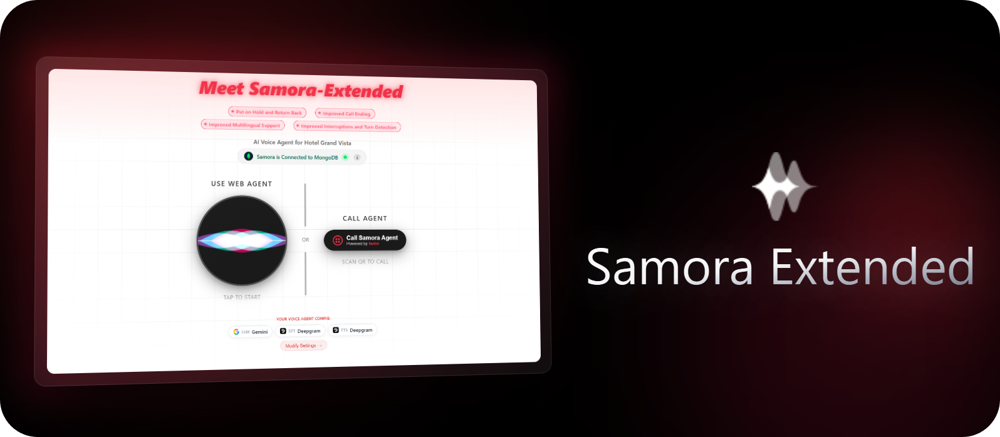

<h1 align="center">Samora Extended: A Project Demo</h1>

  

  
  
  
  
  

  
  
  
  

  
  
  

  
  
  
  

## Overview

## Observations/Gaps in Current Agents and Corresponding Fixes/Improvements  Introduced
While testing Samora’s demos and exploring agent behavior, the following observations were made. For each, a corresponding feature or fix was introduced to address the gap/issue.

| **Features**                                                      | **Observations in Current Samora Agents**                                                                                                                                                                                                                                                                                                                                                                                                                                                                                                                                                                                                                                                                                                                                                                                                                                                                                                                                                                                                                                                                                                | **Improvements Introduced**                                                                                                                                                                                                                                                                                                                                                                                                                                                                                                                                                                                                                                                                                                                                                                                                                                                                                                                                                                                                                                                                                                                                                                                                                                                                                                                                                                                                                                                                                                                                                                                                                           |
| ----------------------------------------------------------------- | ---------------------------------------------------------------------------------------------------------------------------------------------------------------------------------------------------------------------------------------------------------------------------------------------------------------------------------------------------------------------------------------------------------------------------------------------------------------------------------------------------------------------------------------------------------------------------------------------------------------------------------------------------------------------------------------------------------------------------------------------------------------------------------------------------------------------------------------------------------------------------------------------------------------------------------------------------------------------------------------------------------------------------------------------------------------------------------------------------------------------------------------- | ----------------------------------------------------------------------------------------------------------------------------------------------------------------------------------------------------------------------------------------------------------------------------------------------------------------------------------------------------------------------------------------------------------------------------------------------------------------------------------------------------------------------------------------------------------------------------------------------------------------------------------------------------------------------------------------------------------------------------------------------------------------------------------------------------------------------------------------------------------------------------------------------------------------------------------------------------------------------------------------------------------------------------------------------------------------------------------------------------------------------------------------------------------------------------------------------------------------------------------------------------------------------------------------------------------------------------------------------------------------------------------------------------------------------------------------------------------------------------------------------------------------------------------------------------------------------------------------------------------------------------------------------------- |
| **Rolling Summarizer Context Window Manager**                     | `Observation`: -   `Example`: -   `Note & Motivation`: -                                                                                                                                                                                                                                                                                                                                                                                                                                                                                                                                                                                                                                                                                                                                                                                                                                                                                                                                                                                                                                                                     | `Fix:` The `RollingSummarizerContextManager` class is implemented from scratch as a subclass of `FrameProcessor`, specifically designed to monitor and manage the size of the `LLMContext`. It is configured with two key parameters, `threshold` and `keep_recent`. The `threshold` (e.g., 100) defines the maximum number of messages allowed before summarization is triggered, while `keep_recent` (e.g., 20) determines how many of the most recent messages are preserved in full. Once the number of messages exceeds the threshold, the `_run_summarization()` function is triggered to summarize the middle section of the conversation using the active `llm_service` through its `run_inference()` method, keeping the system prompt and latest messages intact. The summarization process executes asynchronously in a separate coroutine, running independently of the main pipeline to ensure that no frame propagation, response generation, or user interaction is ever blocked. Before the context manager updates the `LLMContext` with the summarized and latest messages, it waits for a safe synchronization point, specifically when an `LLMFullResponseEndFrame` is received, ensuring that no active LLM generation or streaming operation is interrupted. At that point, `_apply_pending_merge()` performs an in-place context update using `set_messages()`, replacing older messages with the summarized block and merging any new messages received during summarization. This design keeps the context compact and efficient while maintaining uninterrupted conversation flow, reducing both token load and inference latency. |
| **Put Agent on Hold and Resume Call When Back**                   | `Observation`: In certain service or booking calls, users may need to pause the conversation to think, consult with someone nearby, or discuss details with another person in the same room. For example, while making a reservation, a person might check with their partner about changing dates or confirming details. Similarly, in service-related calls, a family member might answer and ask the agent to stay on the line until the intended person arrives. In these cases, the user implicitly expects the agent to stay on call silently until they return. However, as soon as any background conversation begins, the agent mistakenly assumes the speech is directed at it and starts responding, interrupting the user instead of remaining on hold.   `Example`: All agents currently lack the ability to stay on hold. When asked to "please stay on the call" or "hold on a second", they reply with phrases like "Sure, let me know when you're back", but immediately start speaking again as soon as they detect background speech, instead of waiting silently until the user explicitly says they are back. | `Fix:` Implemented the `put_on_hold` tool integrated with a custom `HoldWakeProcessor` class to manage real-time hold and resume logic within the pipeline. When invoked, the tool sets `is_on_hold = True` through `hold_wake_processor.set_hold(True)` and queues a `TTSSpeakFrame` response: "No problem! I'll wait right here. Just say I'm back when you're ready to continue." The `HoldWakeProcessor` class extends `FrameProcessor` and intercepts all incoming `TranscriptionFrame` objects while the agent is on hold, filtering them through regex-based wake phrase detection (`WAKE_PROMPTS` such as "I'm back", "let's continue", "you there"). Non-matching frames are silently dropped to suppress unintended speech detection. Once a valid wake phrase is detected, the class resets `is_on_hold` to `False`, pushes the transcription downstream, and resumes normal LLM processing through the `LLMContext` and `LLMResponseAggregator`. The processor also cooperates with the `UserIdleProcessor`, ensuring idle triggers are suspended during hold mode, preventing false "are you still there?" prompts. This implementation allows the agent to remain silently connected and resume naturally once the user returns, maintaining conversational continuity and context integrity across interruptions.                                                                                                                                                                                                                                                                                                                      |
| **Improved Call Ending for Agents**                               | `Observation`: When asked to end the call, some agents say their closing lines and goodbye but stay idle afterward, triggering the user-idle detection instead of properly ending the conversation. Others disconnect immediately without confirming if the user needs more help, resulting in abrupt endings.  `Example`: For the US Accent, Real Estate and Non-Profit agents say their goodbyes but then remain silent and ask "Hey, are you there?", lingering on the line instead of ending the call. Meanwhile, the Hospitality and Service Feedback agents cut the call instantly without any closure or offer for further help while closing out.                                                                                                                                                                                                                                                                                                                                                                                                                                                                          | `Fix:` Implemented the `end_call` tool and added instructions and examples for the LLM to observe and handle call endings correctly. The LLM now follows a two-step process: when the user asks to end the call or the conversation seems to be concluding, the agent first responds politely, for example: **Caller:** "Actually, I have to go." **Agent:** "No problem at all! Before you go, is there anything quick I can help with?" If the user confirms, the `end_call` tool is triggered, which outputs a `TTSSpeakFrame` saying "It was great talking with you! Feel free to reach out anytime. Take care!", followed by an `EndFrame()` that gracefully disconnects the pipeline, closing the call or web agent on the frontend.                                                                                                                                                                                                                                                                                                                                                                                                                                                                                                                                                                                                                                                                                                                                                                                                                                                                                                   |
| **Multilingual Language Support**                                 | `Observation`: The demo agents currently support conversations only in English and Hindi. If a user is not comfortable in either of these languages, the system fails to handle inputs in other languages or when users switch mid-conversation to their native language for better clarity or comfort.  `Example`: When any agent with a US accent is asked if they can speak another language, they respond that they can only speak and support English. If a user greets in another language such as Spanish ("Hola") or Tamil ("Vanakkam"), the agent either stays silent or misinterprets the phrase instead of responding naturally.                                                                                                                                                                                                                                                                                                                                                                                                                                                                                        | `Fix:` Added STT and TTS providers with multilingual language support, along with improved instructions and examples added to the LLM system prompt to ensure language switching happens only after explicit user confirmation, maintaining consistent and controlled conversation flow. Now, if a user speaks in Japanese (e.g., "日本語で話せますか?"), the agent detects the language and replies naturally with a confirmation prompt like "I see you are speaking in Japanese, would you like me to switch to Japanese?". Once confirmed, the conversation continues in Japanese. If a user asks if they can speak in French, the same confirmation process occurs, and the conversation then flows in French until the user switches back to English or explicitly requests a language change.                                                                                                                                                                                                                                                                                                                                                                                                                                                                                                                                                                                                                                                                                                                                                                                                                                                           |
| **Fixed Tool Call/System Prompt Spillover to LLM and TTS Output** | `Observation`: There are leaks of tool call syntax or internal system prompts into LLM and TTS output, causing the agent to utter unintended technical phrases.  `Example`: For the US Accent, Real Estate Agent, when the user interrupts by saying "stop" or "pause", the agent responds with internal terms like "break time" followed by a time duration, which then persists across subsequent conversations.                                                                                                                                                                                                                                                                                                                                                                                                                                                                                                                                                                                                                                                                                                                 | `Fix:` The same behavior was observed during local testing on my system, when using smaller models from providers such as Cerebras and Groq (e.g., 70B or 8B variants). It was mitigated by switching to larger, more stable models with much better tool calling from providers like OpenAI and Gemini, which resolved the spillover issue and restored proper conversation flow.                                                                                                                                                                                                                                                                                                                                                                                                                                                                                                                                                                                                                                                                                                                                                                                                                                                                                                                                                                                                                                                                                                                                                                                                                                                                    |

## Features

To address the observed gaps and demo a more holistic experience, a scenario was built around a Voice AI Agent serving as a Hotel Front Desk concierge, similar to other Samora agents in hospitality and service domains.

In addition to addressing the observed gaps, the following features are part of the Samora-Extended Demo, showcasing a complete, fully functional concierge agent.

* **Live MongoDB Database Access**: Connected to a MongoDB instance, the agent handles hotel tasks like availability checks, bookings, updates, cancellations, and special requests. All write operations are executed in real time using custom tools for each database function, with updates reflected instantly and confirmed once complete. The agent supports eight dedicated database tools: `check_availability`, `book_room`, `lookup_booking`, `update_booking`, `cancel_booking`, `add_special_request`, `get_amenities`, and `get_pricing`.

* **Agent Configuration**: A frontend Settings panel allows dynamic selection of LLM, TTS, and STT models at runtime. Any combination of one model from each category can be selected without redeployment.

  * **STT Models**: Deepgram (`nova-3`), ElevenLabs (`scribe_v2_realtime`)
  * **LLM Models**: OpenAI (`gpt-4o-mini`), Cerebras (`llama-3.3-70b`), Groq (`llama-3.3-70b-versatile`), Google (`gemini-2.5-flash`)
  * **TTS Models**: Deepgram (`aura-2-theia-en`), Cartesia (Voice ID `248be419-c632-4f23-adf1-5324ed7dbf1d`)

* **Context Configuration**: A frontend UI to configure when the Rolling Context Summarizer activates and how much recent conversation to retain. This helps manage token usage in the long run and cut down on costs, while maintaining continuity in long conversations. The following parameters are exposed in the Settings panel:

  * `context_threshold`: Number of messages after which summarization is triggered
  * `context_keep_recent`: Number of most recent messages to keep in the latest context without being summarized

* **Web Deployment**: Backend hosted on Pipecat Cloud and frontend on Vercel. The agent is accessible via both the website and a Twilio phone number, supporting smooth interaction across browser and phone.

  * **Web Site for Web Agent Access**: [https://samora-extended.nnilayy.com/](https://samora-extended.nnilayy.com/)
  * **Twilio Phone Number for Phone-based Agent Interaction**: +1 (520) 652-1762

## License

This project is licensed under the **MIT License** - checkout the [LICENSE](LICENSE) for more details.

## Support & Contact

If you have any questions or need further assistance, feel free to reach out:

- **GitHub Issues**: [Issues Page](https://github.com/nnilayy/samora-extended/issues/new)
- **Email**: nnilayy.work@gmail.com

---

Made with ❤️ by <a href="https://github.com/nnilayy">nnilayy</a>
